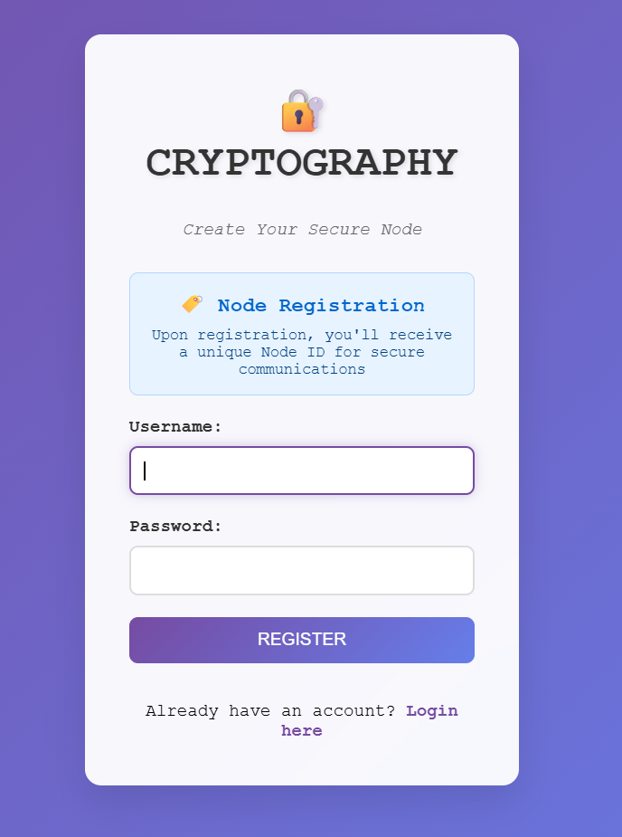
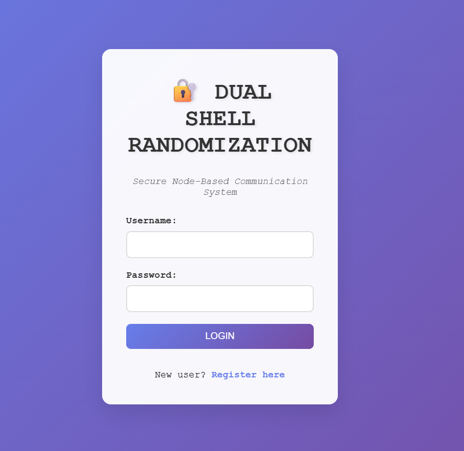
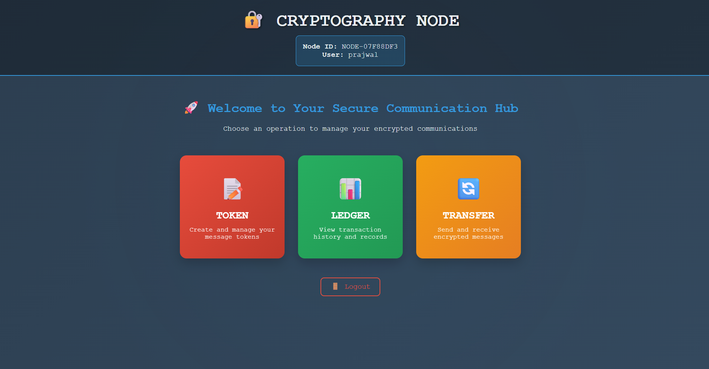
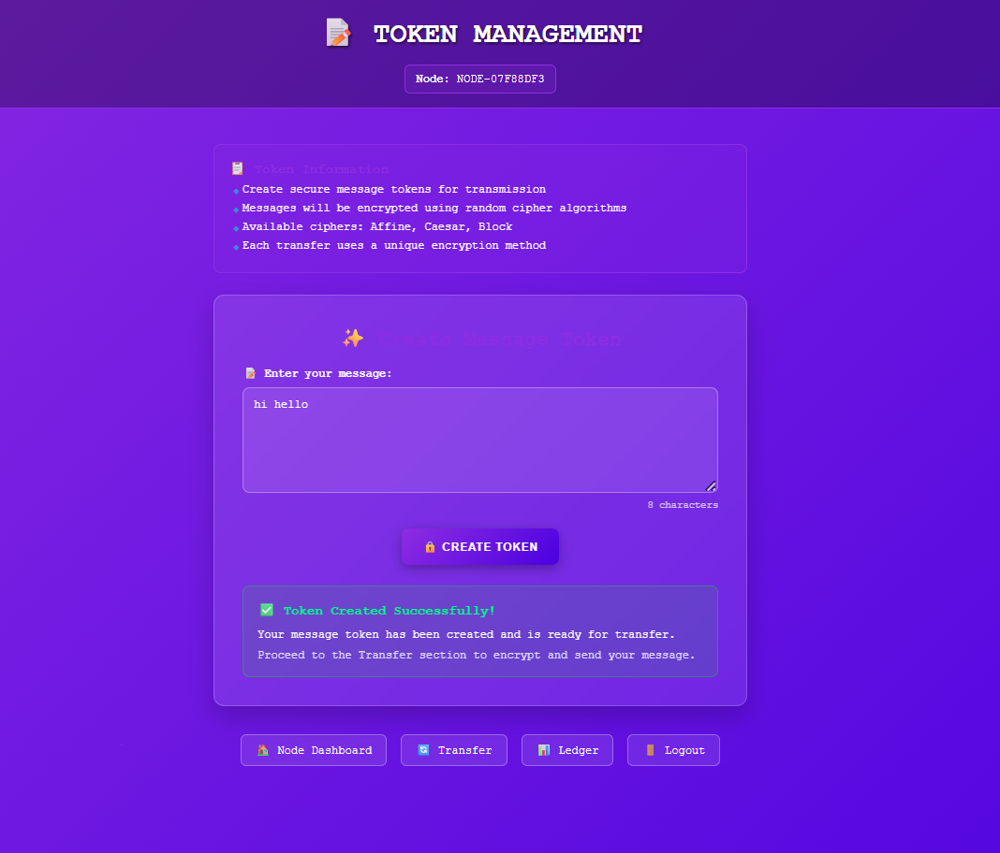
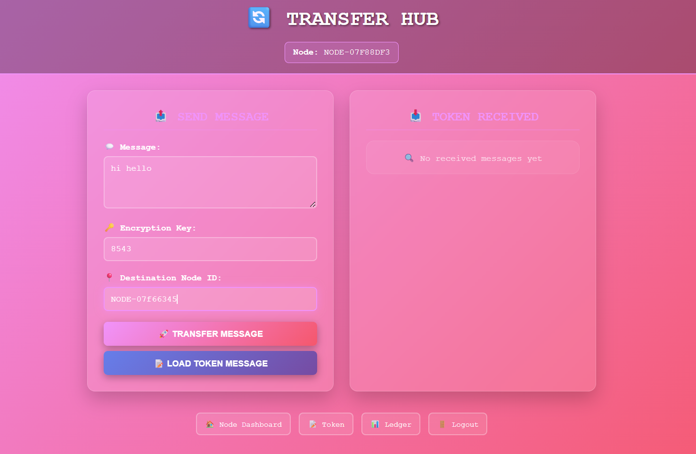

# Self-Securing Cryptocurrency using Blockchain (Spring Boot)

## Overview
This project implements a Blockchain-inspired web application built using Spring Boot and Maven. The system enables secure token transfer between distributed nodes using randomized encryption algorithms. It integrates cryptography, distributed ledger concepts, and database-backed transaction tracking to simulate blockchain behavior.

---

## Key Features

###User Authentication
- User Registration and Login
- Credentials stored securely in MySQL database
- Redirects authenticated users to Node Dashboard

### Token Management
- Users can create tokens using text input
- Tokens are associated with specific nodes

### Secure Token Transfer
- Tokens are transferred between nodes (Next / Previous)
- Randomly selects one of:
  - Affine Cipher
  - Caesar Cipher
  - Block Cipher
- Encryption occurs before transmission
- Decryption requires same user-provided key

### Distributed Ledger
- Every transaction is recorded with:
  - Node Number
  - Key
  - Transferred Node
  - Transaction ID (Primary Key)
- Ledger synchronization across nodes
- Simulates blockchain immutability

---

## Database Structure 

### Tables:
1. **Users**
2. **Tokens**
3. **Transactions**

### Ledger Fields:
- Node Number
- Encryption Key
- Transferred Node
- Transaction ID (Primary Key)

---

## Technologies Used
- Java
- Spring Boot
- Maven
- MySQL
- Thymeleaf
- Cryptographic Algorithms (Affine, Caesar, Block Cipher)

---

## Architecture
- Controller Layer
- Service Layer
- Repository Layer
- Entity Models
- Database Integration

---

## Security Concepts Demonstrated
- Randomized encryption selection
- Secure key-based decryption
- Immutable transaction records
- Blockchain-inspired ledger consistency

---

## Learning Outcomes
- Integration of cryptography with web applications
- Simulation of blockchain ledger behavior
- Secure token-based data transfer
- Distributed transaction synchronization

---

## Application Screenshots

### Node Registration

Create a secure node account to generate a unique Node ID for encrypted communication.

---

### Login Page

Registered users can securely log in using their credentials to access the system.

---

### 🖥 Node Dashboard

After login, users can access Token, Transfer, and Ledger functionalities from the dashboard.

---

### Token Creation

Users create secure message tokens that will be encrypted before transmission.

---

### Transfer Hub

Send encrypted messages to another node using a secret encryption key and destination Node ID.

---

### Message Decryption

The receiver enters the correct encryption key to decrypt and view the secured message.

---

### Transaction Ledger

View all recorded transactions and track secure message transfers between nodes.

## Author
Lepakshi Vyshnavi  
Integrated M.Tech CSE | VIT-AP University
